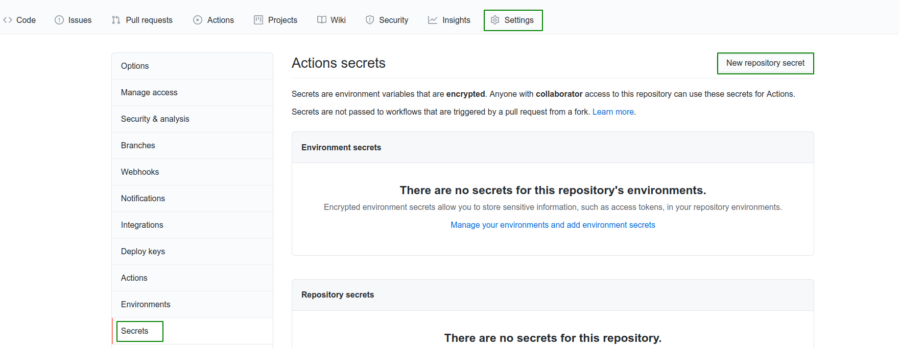
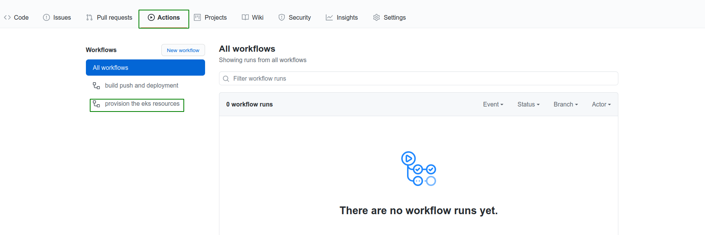
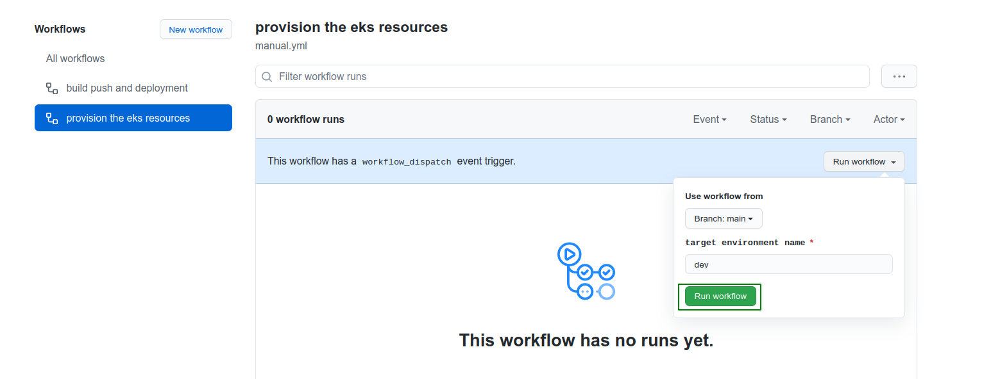
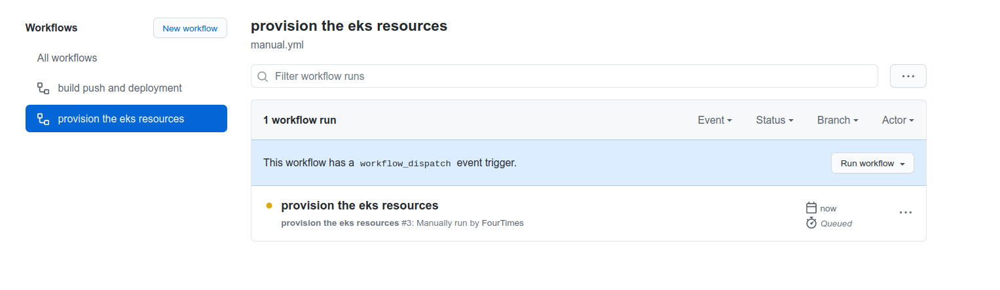

# AWS EKS TERRAFORM

----------------

    1. Create the ec2 pem key => need to mentioned in config.tfvars
    2. Backend S3 bucket
    3. IAM users 
    
        1. AWS access key
        2. AWS secret key

----------------

# PROCESS FLOWS

----------------

# 1

# 2

# 3

----------------

# RESOURCE PROVISION DEPLOYMENT

----------------

# 1

# 2

# 3

----------------
